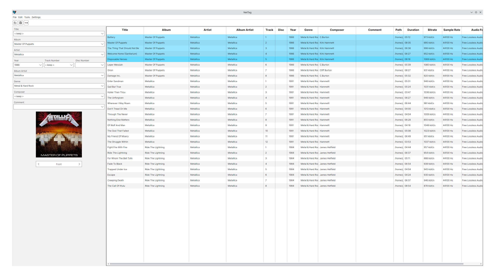

# NetTag

Program to edit metadata on audio files

Primarily developed for Linux

Inspired by [Mp3Tag](https://www.mp3tag.de/en/)

Uses [Audio Tools Library (ATL) for .NET](https://github.com/Zeugma440/atldotnet)

